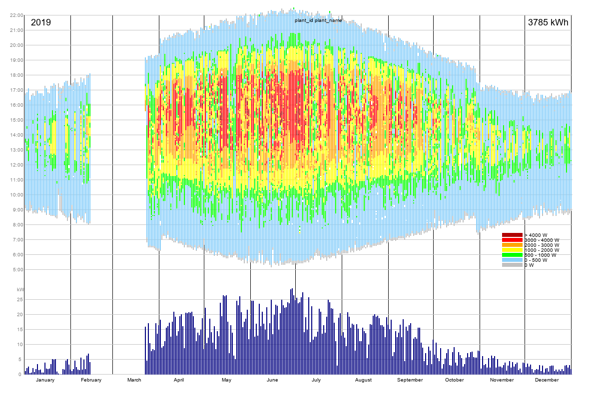

# Solarview

**Solarview** is a Python3-application that produces a per year heatmap of solar PV energy production
using the Growatt server data. See example below.  
The lower diagram shows the total power production per day.  
The upper diagram shows for each day the actual powerproduction per 5 minute interval between **5:00** (5 AM) and **22:00** (10:00 PM). 

Reads the production data from the Growatt server (http://growatt.server.com)  
using the GrowattShinePhone api, stores them locally and incrementally.

Runs on **Windows**, **Linux** (RaspBian, Ubuntu) and **Android** (using PyDroid3).

Needs a **solarview.ini** file with the following contents:  
[ini]  
username=YourUserName  
password=YourPassword  
pickle_dir="./"  
pickle_template="solarviewdata_????.pkl"  

Dependencies:  
requests
         
Uses:  
GrowattApi: https://github.com/Sjord/growatt_api_client,
included in this file

  
*Absence of data from February 12 until March 20 due to malfunctioning ShineWifi hardware.*  

